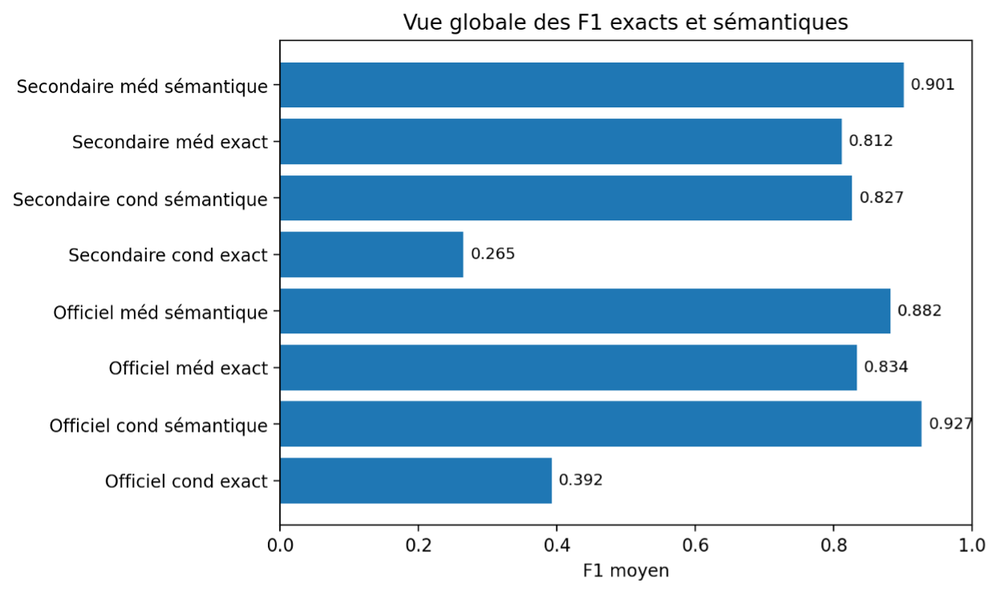
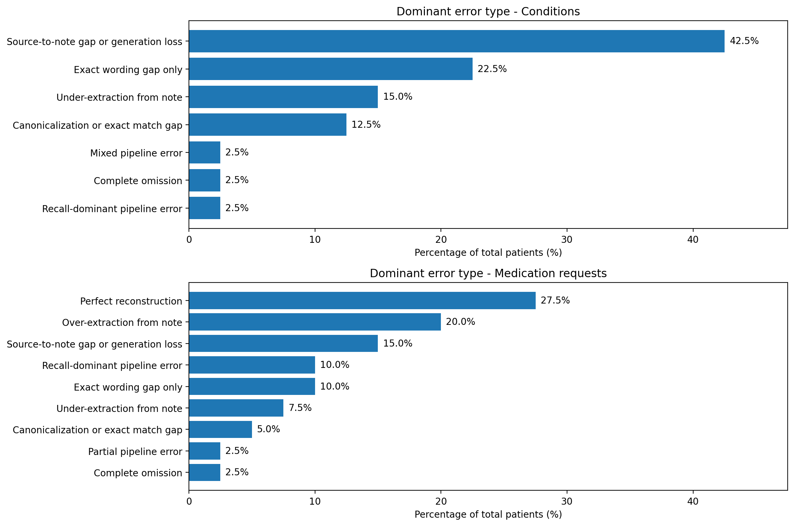

# Rapport benchmark

## Objectif

Cette page résume les principaux enseignements du benchmark final.

## Taille du benchmark

Le benchmark final a été réalisé sur 40 patients.

Plusieurs styles de notes ont été utilisés pour tester la robustesse du pipeline face à des formes variées de rédaction clinique.

## Résultats principaux

### 1. Le pipeline fonctionne globalement bien

Les résultats montrent que la chaîne produit des reconstructions exploitables et qu’elle peut être benchmarkée de manière structurée.

### 2. Les medication requests sont mieux reconstruites que les conditions

C’est le constat principal du benchmark.

### 3. Les conditions ont un écart important entre exact et sémantique

Cela signifie que le pipeline retrouve souvent le bon sens clinique, mais pas toujours le bon libellé exact ou la bonne forme canonique.

### 4. Certains styles de note sont plus robustes que d’autres

Les styles ne se valent pas tous. Certains facilitent davantage la reconstruction.

### 5. Une partie de la perte apparaît avant la reconstruction finale

Les erreurs ne viennent pas seulement de l’extracteur final.

La comparaison entre **note vs recon** et **source vs recon** suggère qu’une partie de la perte semble venir de la transmission source -> note.

## Résultats visuels

### Vue globale des performances

| Indicateur | Valeur |
|---|---:|
| Note vs recon conditions exact F1 | 0.392 |
| Note vs recon conditions sémantique F1 | 0.927 |
| Note vs recon medication requests exact F1 | 0.834 |
| Note vs recon medication requests sémantique F1 | 0.882 |
| Source vs recon conditions exact F1 | 0.265 |
| Source vs recon conditions sémantique F1 | 0.827 |
| Source vs recon medication requests exact F1 | 0.812 |
| Source vs recon medication requests sémantique F1 | 0.901 |

*Figure 1 : vue globale des F1 exacts et sémantiques.*

### Comparaison par style de note

| Style de note | Note vs recon cond exact F1 | Note vs recon méd exact F1 | Source vs recon cond exact F1 | Source vs recon méd exact F1 | Taux consistent |
|---|---:|---:|---:|---:|---:|
| Health check summary | 0.474 | 0.909 | 0.351 | 0.887 | 0.900 |
| Medical history note | 0.521 | 0.916 | 0.352 | 0.902 | 0.900 |
| Short consultation note | 0.126 | 0.746 | 0.067 | 0.694 | 0.900 |
| Telegraphic note | 0.449 | 0.763 | 0.289 | 0.763 | 0.800 |

*Figure 2 : comparaison des F1 exacts par style de note.*

### Analyse des erreurs

*Figure 3 : catégories d’erreurs les plus fréquentes pour les conditions et les medication requests.*

### Vérification

| Verdict | Nombre |
|---|---:|
| consistent | 35 |
| unknown | 5 |

*Figure 4 : vérification par style de note.*

## Lecture recommandée des résultats

Pour lire les résultats :

- commencer par les synthèses globales
- regarder ensuite les résultats par style de note
- lire ensuite l’analyse des erreurs
- consulter enfin les exemples patients

## Fichiers les plus importants

- [Scores globaux](../results/summaries/metrics/df_scores_overall_summary.csv)
- [Scores par style](../results/summaries/metrics/df_scores_summary_by_note_style.csv)
- [Analyse des erreurs](../results/summaries/errors/df_error_analysis.csv)
- [Vérification](../results/summaries/verification/df_verification.csv)
- [Cas difficiles](../results/summaries/errors/df_hard_cases_by_note_style.csv)

## Conclusion

Le benchmark est globalement positif.

Le pipeline est particulièrement convaincant sur les medication requests. Le principal axe d’amélioration concerne les conditions, en particulier leur fidélité exacte tout au long de la chaîne.
