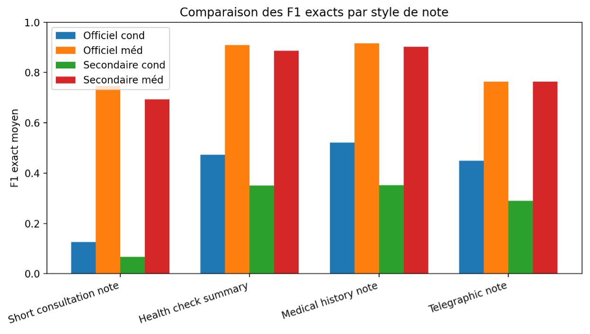
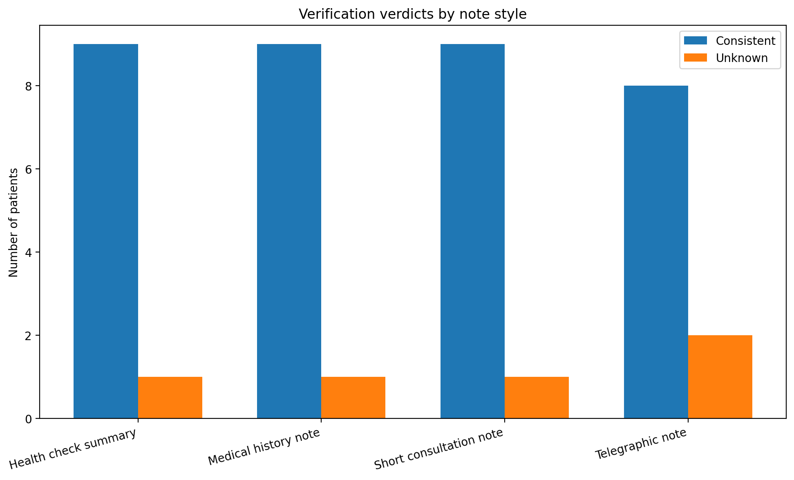

# Guide des résultats

## Objectif

Cette page explique comment lire les résultats du benchmark.

Le projet produit plusieurs niveaux de résultats :

- tables intermédiaires
- tables de synthèse
- analyse des erreurs
- vérification
- cas difficiles
- index de lecture

## 1. Résultats intermédiaires

Ces fichiers permettent de suivre la chaîne principale :

- `df_gold.csv`
- `df_notes.csv`
- `df_recon.csv`

Ils correspondent respectivement à :

- la source structurée de référence
- la note générée
- la reconstruction structurée

## 2. Tables longues

Ces fichiers détaillent les éléments médicaux ligne par ligne :

- `df_gold_conditions_long.csv`
- `df_gold_medreq_long.csv`
- `df_recon_conditions_long.csv`
- `df_recon_medreq_long.csv`

Ils sont utiles pour :

- inspecter les items individuellement
- comprendre les écarts de matching
- vérifier les différences entre gold et reconstruction

## 3. Résultats de scoring

Les fichiers de scoring principaux sont :

- `df_scores.csv`
- `df_scores_overall_summary.csv`
- `df_scores_summary_by_note_style.csv`

### `df_scores.csv`

Résultats détaillés patient par patient.

Ce fichier contient les scores calculés selon les deux lectures principales :

- **note vs recon**
- **source vs recon**

### `df_scores_overall_summary.csv`

Vue globale du benchmark.

### `df_scores_summary_by_note_style.csv`

Vue agrégée par style de note.

## 4. Analyse des erreurs

Les fichiers principaux sont :

- `df_error_analysis.csv`
- `df_error_types_by_note_style_conditions.csv`
- `df_error_types_by_note_style_medication_requests.csv`
- `df_hard_cases_by_note_style.csv`

Ils permettent de comprendre :

- quels types d’erreurs dominent
- quels styles de notes sont les plus difficiles
- quels patients représentent des cas complexes

## 5. Vérification

Le fichier principal est :

- `df_verification.csv`

Il contient la couche de vérification automatique de cohérence.

## 6. Fichiers de revue

Les fichiers complémentaires sont :

- `df_export_review.csv`
- `df_index.csv`

Ils servent à :

- faciliter la navigation dans les exports
- contrôler rapidement le contenu généré
- vérifier que les fichiers finaux sont bien présents

## 7. Ordre de lecture conseillé

Je conseille l’ordre suivant :

1. `df_scores_overall_summary.csv`
2. `df_scores_summary_by_note_style.csv`
3. `df_error_analysis.csv`
4. `df_verification.csv`
5. `df_hard_cases_by_note_style.csv`
6. `df_scores.csv`
7. puis les tables intermédiaires et longues

## 8. Résultats visuels

### Comparaison des scores par style de note

| Style de note | Note vs recon cond exact F1 | Note vs recon méd exact F1 | Source vs recon cond exact F1 | Source vs recon méd exact F1 | Taux consistent |
|---|---:|---:|---:|---:|---:|
| Health check summary | 0.474 | 0.909 | 0.351 | 0.887 | 0.900 |
| Medical history note | 0.521 | 0.916 | 0.352 | 0.902 | 0.900 |
| Short consultation note | 0.126 | 0.746 | 0.067 | 0.694 | 0.900 |
| Telegraphic note | 0.449 | 0.763 | 0.289 | 0.763 | 0.800 |

*Figure : comparaison des performances exactes par style de note.*

### Vérification par style de note

| Verdict | Nombre |
|---|---:|
| consistent | 35 |
| unknown | 5 |

*Figure : résultats de la chaîne de vérification selon le style de note.*

## 9. Messages principaux du benchmark

Les conclusions principales sont les suivantes :

- les medication requests sont mieux reconstruites que les conditions
- les conditions ont souvent de bons résultats sémantiques mais des résultats exacts plus faibles
- certains styles de note sont plus robustes que d’autres
- une partie des pertes d’information apparaît avant la reconstruction finale

## Voir aussi

- [Pipeline détaillée](pipeline_explained.md)
- [Rapport benchmark](benchmark_report.md)
